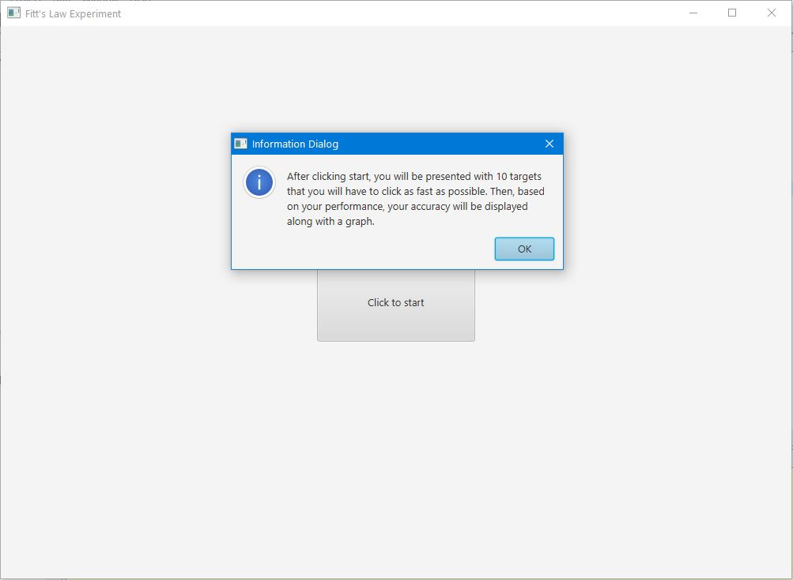
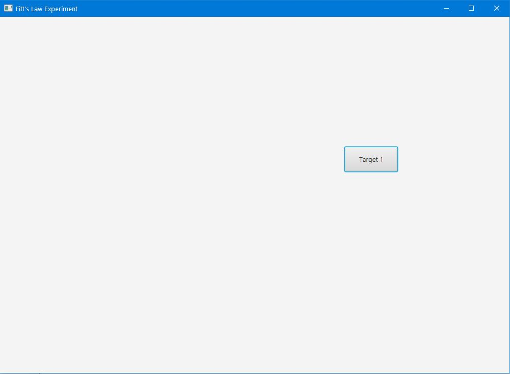
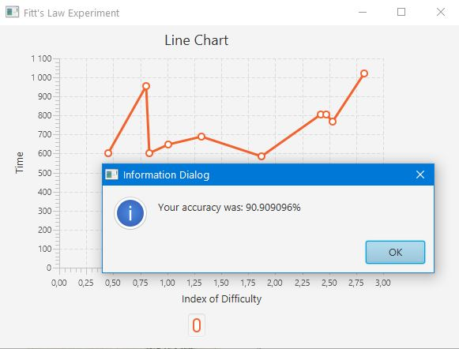

# Fitts-Law-Experiment
An experiment testing Fitts's law implemented in Java. The UI was designed using JavaFX. According to Fitts's Law,
the time required to quickly move to a target area is a function of the ratio between the distance to the target and 
the width of the target (Wikipedia). After completing the task the user is presented with a line chart of time taken 
to click a target vs the index of difficulty of the target (= log base 2 of (target_distance/target_width +1)).

To run the project, simply run Driver.java that contains the main method.

## How to use
### 1. Read the instructions and click start

### 2. Click the targets as fast as possible

### 3. Analyze the results

